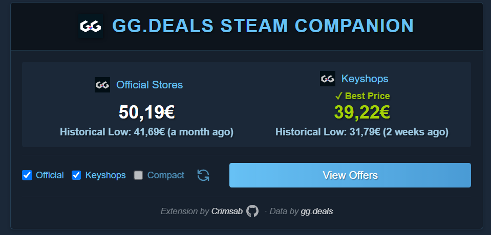

# GG.deals Steam Companion

A userscript that enhances Steam store pages by displaying price comparisons from GG.deals directly on the game page.

 

> **Disclaimer**: This is an unofficial userscript and is not affiliated with, endorsed by, or connected to GG.deals or Steam in any way. This script simply provides a convenient interface to publicly available data from GG.deals.

## Installation

1. First, install a userscript manager:
   - [Tampermonkey](https://www.tampermonkey.net/) (Recommended)
   - [Violentmonkey](https://violentmonkey.github.io/)
   - [Greasemonkey](https://www.greasespot.net/)

2. Click this link to install the script: 
**[➡️ INSTALL GG.DEALS STEAM COMPANION ⬅️](https://raw.githubusercontent.com/Crimsab/ggdeals-steam-companion/main/userscript.user.js)**

   If the automatic installation doesn't work:
   - Open your userscript manager's dashboard
   - Create a new script
   - Copy and paste the contents from [this link](https://raw.githubusercontent.com/Crimsab/ggdeals-steam-companion/main/userscript.user.js)
   - Save the script

## Example

## Features

- Shows real-time price comparisons from official stores and keyshops
- Displays historical low prices with dates
- Clean and modern UI that matches Steam's design
- Toggle between official stores and keyshop prices
- Remembers your display preferences
- Automatic price highlighting for best deals
- Responsive design that works on all screen sizes
- Cache system with 24-hour duration and manual refresh option

## Usage

1. Visit any Game page or DLC page on the Steam store
2. The script will automatically add a price comparison section above the purchase options
3. Use the toggles to show/hide official stores and keyshop prices
4. Click "View Offers" to see all available deals on GG.deals

## Permissions

The script requires the following permissions:
- Access to store.steampowered.com
- Access to gg.deals
- XMLHttpRequest to fetch price data
- Storage to save your display preferences

## Contributing

Feel free to submit issues and enhancement requests!

## Credits

Price data is provided by [GG.deals](https://gg.deals). All trademarks and copyrights belong to their respective owners. 