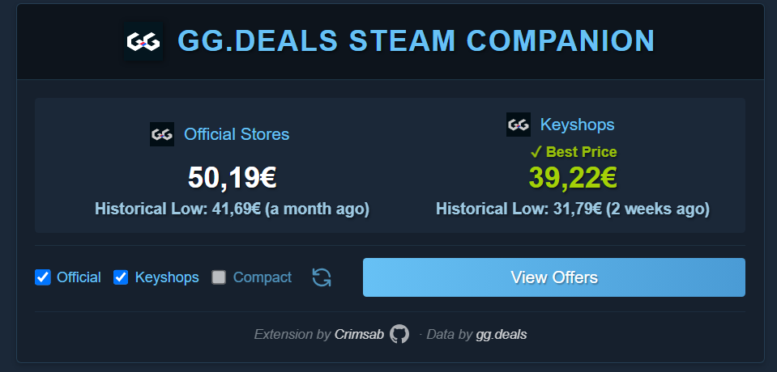
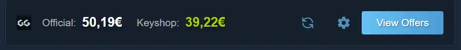
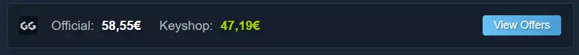

# GG.deals Steam Companion

A userscript that enhances Steam store pages by displaying price comparisons from GG.deals directly on the game page.

[](https://github.com/Crimsab/ggdeals-steam-companion) [](https://greasyfork.org/it/scripts/527356-gg-deals-steam-companion)

> **Disclaimer**: This is an unofficial userscript and is not affiliated with, endorsed by, or connected to GG.deals or Steam in any way. This script simply provides a convenient interface to publicly available data from GG.deals.


## Installation

### Steam Client Extension (Recommended)

Download the latest Chrome/Steam extension archive from the GitHub release:

**[Download GG.deals Steam Companion Chrome/Steam Extension](https://github.com/Crimsab/ggdeals-steam-companion/releases/latest/download/ggdeals-steam-companion-chrome.zip)**

Steam uses a Chromium-based browser, so the extension can be loaded directly inside the Steam client:

1. Download and extract the extension archive.
2. Open Steam.
3. Open a Steam store page, for example:
   `https://store.steampowered.com/app/1158310/Crusader_Kings_III/`
4. Right-click a clickable link on the page and choose **Open link in new tab**.
5. In the Steam browser address bar, open:
   `chrome://extensions`
6. Enable **Developer mode**.
7. Drag the extracted extension folder directly into the `chrome://extensions` page.

Steam's **Load unpacked** button can open a file picker instead of a folder picker on Windows. Dragging the whole extracted folder into the extensions page avoids that Steam-specific picker issue.

### Userscript

1. First, install a userscript manager:
   - [Tampermonkey](https://www.tampermonkey.net/) (Recommended)
   - [Violentmonkey](https://violentmonkey.github.io/)
   - [Greasemonkey](https://www.greasespot.net/)

2. Click this link to install the script: 
**[➡️ INSTALL GG.DEALS STEAM COMPANION ⬅️](https://raw.githubusercontent.com/Crimsab/ggdeals-steam-companion/main/userscript.user.js)**

   If the automatic installation doesn't work:
   - Open your userscript manager's dashboard
   - Create a new script
   - Copy and paste the contents from [this link](https://raw.githubusercontent.com/Crimsab/ggdeals-steam-companion/main/userscript.user.js)
   - Save the script

### Chrome Extension

The Chrome extension is built from the same userscript core with a Manifest V3 wrapper:

```bash
bun install
bun run build:extension
```

For a normal Chromium browser, open `chrome://extensions`, enable Developer mode, choose **Load unpacked**, and select `dist/ggdeals-extension`.

### Firefox Extension

The Firefox extension is submitted to Mozilla Add-ons automatically during releases:

**[GG.deals Steam Companion on Firefox Add-ons](https://addons.mozilla.org/firefox/addon/ggdeals-steam-companion/)**

Mozilla may review a new listed version before it appears publicly. For local temporary installation from source, build the extension, open `about:debugging#/runtime/this-firefox`, choose **Load Temporary Add-on**, and select `dist/ggdeals-extension-firefox/manifest.json`.

## Examples

### Full View


### Compact View


### Bundle/Package View


## Features

- Shows real-time price comparisons from official stores and keyshops
- Displays historical low prices with dates
- Supports the official GG.deals API for more reliable results
- Clean and modern UI that matches Steam's design
- Toggle between official stores and keyshop prices
- Remembers your display preferences
- Automatic price highlighting for best deals
- Responsive design that works on all screen sizes
- Cache system with 24-hour duration and manual refresh option

## Usage

1. Visit any Game page or DLC page on the Steam store
2. The script will automatically add a price comparison section above the purchase options
3. Use the toggles to show/hide official stores and keyshop prices
4. Optionally enable the GG.deals API in the settings panel and save your API key
5. Click "View Offers" to see all available deals on GG.deals

## Changelog

See [CHANGELOG.md](CHANGELOG.md).

## Known Limitations

- **API key required**: API mode needs a valid GG.deals API key.
- **Steam packages and bundles**: Supported through GG.deals API endpoints when API mode is enabled.
- **Cloudflare Protection**: GG.deals website uses Cloudflare which may block automated requests, like the Steam Resolvers (HTTP 403 errors)
- **API vs Web Scraping**: API is recommended for best reliability and performance
- **Cloudflared**: Cloudflare Tunnel does not bypass third-party Cloudflare challenges. It can expose your own services, but it cannot make GG.deals scraping reliable.

## Troubleshooting

### Common Issues

**"No data found for this game"**
- This usually means the game isn't in GG.deals database
- Steam apps, packages, and bundles use their matching GG.deals API endpoint when API mode is enabled
- Try refreshing the page or using the manual refresh button

**HTTP 403 Errors**
- Cloudflare is blocking the request
- Enable API usage with a valid API key for best results
- Web scraping may be temporarily unavailable
- The script should keep the GG.deals section visible with a fallback link even when scraping is blocked

**Prices not updating**
- Check if API is enabled and API key is valid
- Try manual refresh button
- Check browser console for detailed error messages

## Development

This project uses [Bun](https://bun.sh/) for local checks.

```bash
bun install
bun run check
```

The check command validates the userscript syntax and runs smoke tests against a mocked Steam page.

`bun run build:extension` creates:

- `dist/ggdeals-extension` for Chrome/Steam local unpacked installation
- `dist/ggdeals-extension-firefox` for Firefox temporary installation
- `dist/ggdeals-steam-companion-chrome.zip` for release upload
- `dist/ggdeals-steam-companion-firefox.zip` for unsigned Firefox build inspection
- `dist/ggdeals-steam-companion-source.zip` for Mozilla Add-ons source review

GitHub Actions submits the Firefox build to Mozilla Add-ons when `AMO_JWT_ISSUER` and `AMO_JWT_SECRET` repository secrets are configured.

To prepare a release version:

```bash
bun run release:version 2.0.0
bun run check
```

This updates `package.json`, `extension/manifest.json`, the userscript metadata header, and `CHANGELOG.md`.

### Debug Information

The script provides detailed error logging in the browser console (F12 → Console) including:
- Request URLs and status codes
- Steam IDs being used
- API responses and error details
- Timestamps for all operations

## Permissions

The script requires the following permissions:
- Access to store.steampowered.com
- Access to gg.deals
- XMLHttpRequest to fetch price data
- Storage to save your display preferences

## Contributing

Feel free to submit issues and enhancement requests!

## Credits

Price data is provided by [GG.deals](https://gg.deals). All trademarks and copyrights belong to their respective owners. 
